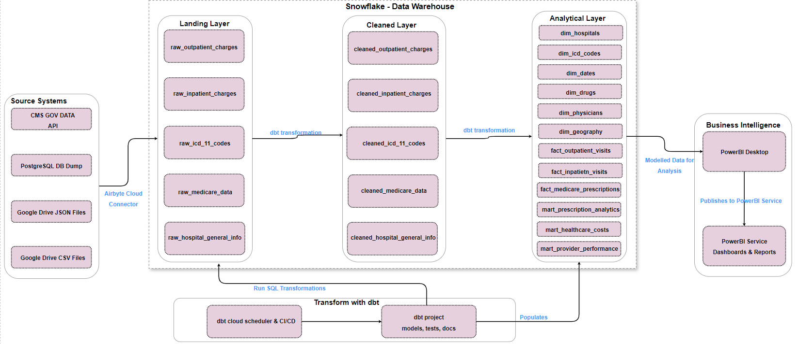
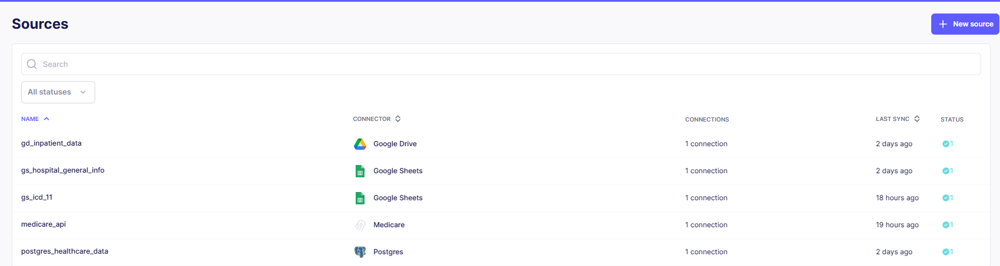
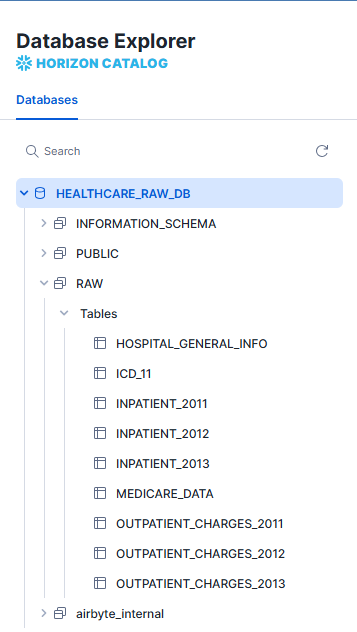

# medicare-ELT-analytics
An end-to-end data pipeline built with Airbyte and dbt Cloud to transform and analyze Medicare inpatient and outpatient charge data. Loaded into Snowflake and visualized with Power BI.

# The Data Ingestion Story: From Multiple Sources to Snowflake Raw

## Chapter 1: Laying the Foundation

I started by building my data warehouse foundation in **Snowflake**. I created dedicated entities—`HEALTHCARE_RAW_DB` database, `RAW` schema, and `AIRBYTE_HEALTHCARE` role—to ensure clean separation and cost tracking for ingestion.

## Chapter 2: The First Connection - Google Sheets

My journey began with the simplest sources: **Google Sheets**. I connected two critical reference files:
- **Hospital General Info**: Master data about healthcare facilities
- **ICD-11 Codes**: Medical classification codes

In Airbyte Cloud, I used the Google Sheets connector, pasted the spreadsheet URLs, and watched as the structured tabular data flowed seamlessly into Snowflake's raw layer. Two tables were born: `_AIRBYTE_RAW_GSHEETS_HOSPITAL_INFO` and `_AIRBYTE_RAW_GSHEETS_ICD_CODES`.

## Chapter 3: Bridging the Local Gap with Ngrok

Next, I tackled my **local PostgreSQL database** containing outpatient charge data from 2011-2013. Since Airbyte Cloud couldn't access my local machine directly, I used **ngrok** to create a secure tunnel. 

I exposed port 5432 to the internet with a simple command: `ngrok tcp 5432`. The magic happened when I took the generated public URL and configured it in Airbyte's PostgreSQL source. Suddenly, my local tables (`outpatient_charges_2011`, `2012`, `2013`) were replicating to Snowflake as if they were in the cloud all along.

## Chapter 4: Taming Unstructured JSON from Google Drive

The most challenging part was the **JSON files** in Google Drive—`inpatient_2011.json`, `2012.json`, `2013.json`. These contained arrays of unstructured patient data. 

The breakthrough came when I used Airbyte's **User Schema** feature. I defined the structure upfront, telling Airbyte how to interpret each field. The JSONL format transformed those nested arrays into clean, typed columns in `_AIRBYTE_RAW_GDRIVE_INPATIENT`.

## Chapter 5: The Real-Time API Connection

Finally, I connected to the **Medicare API** for live healthcare data. The HTTP connector in Airbyte made this surprisingly simple—just the API endpoint and authentication details. I set it to incremental sync mode, ensuring only new data would transfer each month.

## The Grand Finale: Unified Raw Data

Within hours, I had built a robust pipeline ingesting from four disparate sources into a single **Snowflake RAW schema**. The data journey was complete:

- ✅ **Google Sheets** → Reference tables
- ✅ **PostgreSQL (via Ngrok)** → Historical outpatient data  
- ✅ **Google Drive JSON** → Inpatient records
- ✅ **Medicare API** → Live government data

All landing neatly in structured tables, ready for the next transformation phase with dbt. The raw healthcare data ecosystem was alive!

---
*Next Chapter: Transforming raw data into analytics-ready models with dbt Cloud...*
